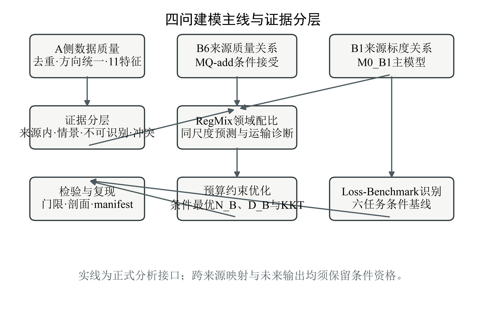
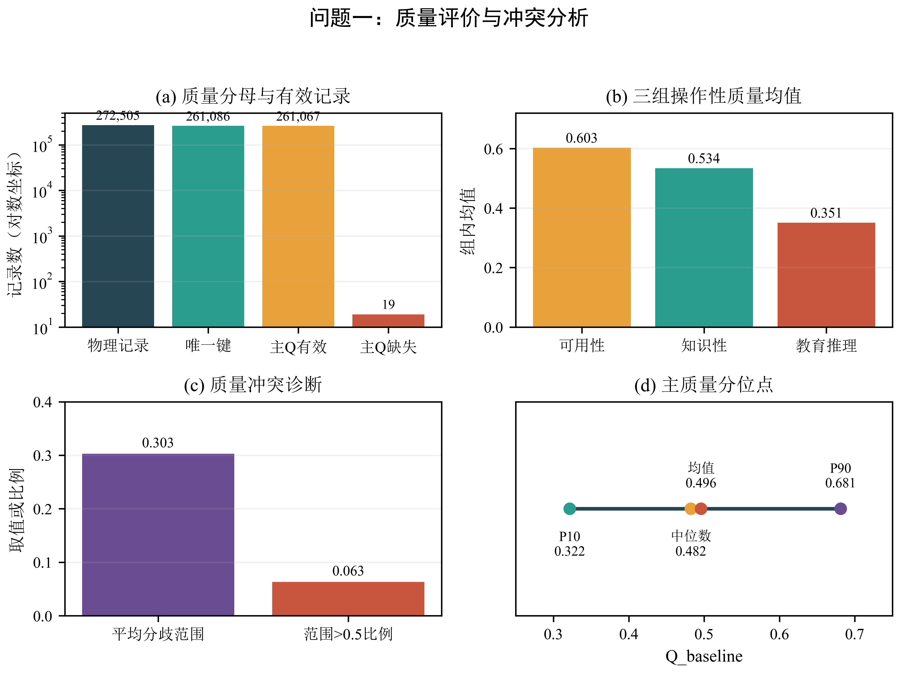
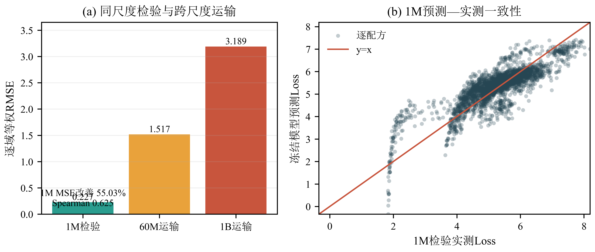
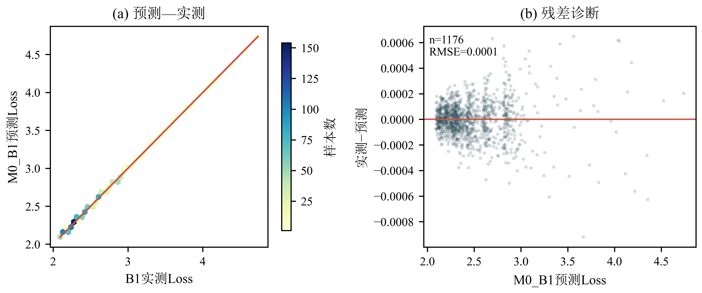
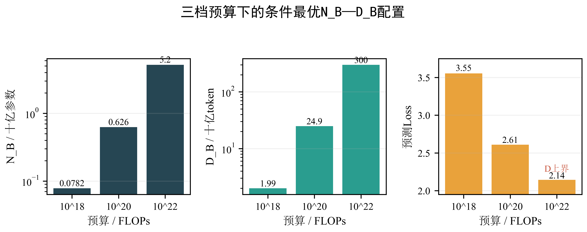
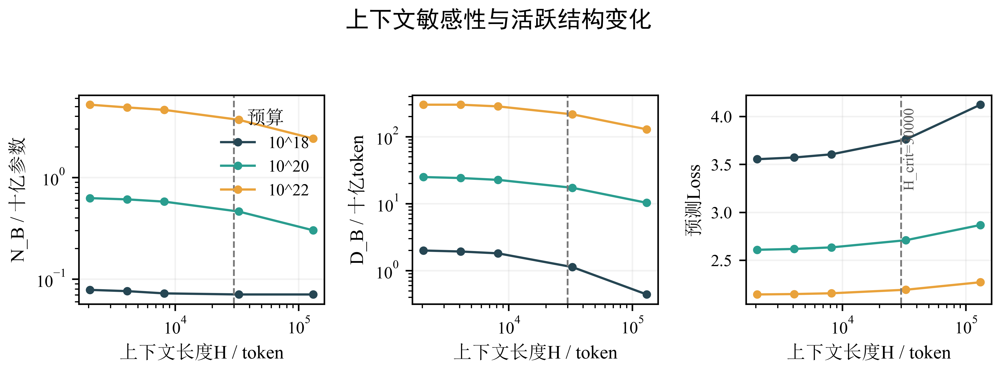
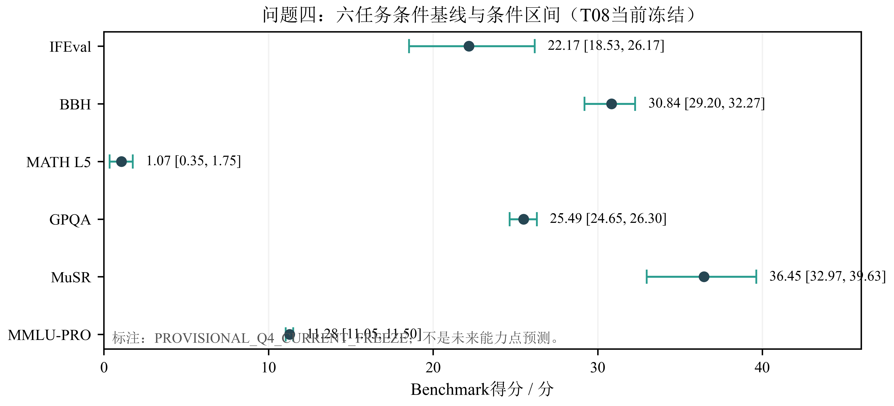

# 算力约束下提升大语言模型能力的资源配置建模

> 阶段性完整候选稿 / INTERNAL REVIEW VERSION

本文围绕算力约束下大语言模型的资源配置问题，构建了从数据质量、缩放规律、预算配置到Benchmark情景的统一分析框架。问题一建立A侧质量评价流水线：对A1–A3全量记录进行去重、方向统一和分组聚合，以11个主质量特征形成Q_baseline，并保留Q_C作为规则敏感性列。全部272505条物理记录去重为261086个唯一键；主质量完整案例261067条。冻结线性配比模型在1M同尺度检验上相对逐域训练均值baseline的MSE改善55.03%，Spearman为0.62507；60M和1B仅作跨尺度运输诊断。

问题二以B1来源内M0_B1为基础缩放模型，得到E=1.6897976、A_N=0.3539803、B_D=1.2403056、α_N=0.3399766、β_D=0.2798781；B6来源内加法质量候选的k_add=0.3544081，并通过方向、留组预测、重采样和数值可识别性门槛。A侧Q_baseline与B侧Q_score之间没有可识别统一映射，H1—H3仅作为情景；配比向B1运输同样仅作情景；B8与B6方向冲突单独保留。

问题三在M0_B1、H=2048且Q、p均不优化的条件下，对1e18、1e20、1e22 FLOPs求条件最优N_B和D_B。三档配置分别为(0.078248576,1.993850677,3.553996156)、(0.625922700,24.925757775,2.609142026)和(5.202388053,299.893000000,2.143211279)，其中最后一档D_B达到B1支持上界。上下文临界值为30000；质量成本、配比运输和B8冲突均按情景或冲突证据报告，不构成单一一般性配置。

问题四审计Loss–Benchmark桥接后确认其资格为仅条件关联。主可比层7个Pythia模型上，IFEval、BBH、MATH Lvl 5、GPQA、MUSR和MMLU-PRO的冻结主模型均为常数模型，六任务条件基线与区间分别报告；辅助均值仅作展示。由于主模型为常数，规模关联项在49条模型×目标记录上为0，但这只表示现有主可比样本不足以支持Benchmark空间的规模预测项。条件剩余项仅称非规模关联残差。时间趋势不可用于外推，未来进展为进展不可识别；12/24个月仅保留相对2025-03-13的2026-03-13和2027-03-13情景时点及条件基线，不生成N、D、compute、Loss或Benchmark增量数值。

## 摘要

本文围绕算力约束下大语言模型的资源配置问题，构建了从数据质量、缩放规律、预算配置到Benchmark情景的统一分析框架。问题一建立A侧质量评价流水线：对A1–A3全量记录进行去重、方向统一和分组聚合，以11个主质量特征形成Q_baseline，并保留Q_C作为规则敏感性列。全部272505条物理记录去重为261086个唯一键；主质量完整案例261067条。冻结线性配比模型在1M同尺度检验上相对逐域训练均值baseline的MSE改善55.03%，Spearman为0.62507；60M和1B仅作跨尺度运输诊断。

问题二以B1来源内M0_B1为基础缩放模型，得到E=1.6897976、A_N=0.3539803、B_D=1.2403056、α_N=0.3399766、β_D=0.2798781；B6来源内加法质量候选的k_add=0.3544081，并通过方向、留组预测、重采样和数值可识别性门槛。A侧Q_baseline与B侧Q_score之间没有可识别统一映射，H1—H3仅作为情景；配比向B1运输同样仅作情景；B8与B6方向冲突单独保留。

问题三在M0_B1、H=2048且Q、p均不优化的条件下，对1e18、1e20、1e22 FLOPs求条件最优N_B和D_B。三档配置分别为(0.078248576,1.993850677,3.553996156)、(0.625922700,24.925757775,2.609142026)和(5.202388053,299.893000000,2.143211279)，其中最后一档D_B达到B1支持上界。上下文临界值为30000；质量成本、配比运输和B8冲突均按情景或冲突证据报告，不构成单一一般性配置。

问题四审计Loss–Benchmark桥接后确认其资格为仅条件关联。主可比层7个Pythia模型上，IFEval、BBH、MATH Lvl 5、GPQA、MUSR和MMLU-PRO的冻结主模型均为常数模型，六任务条件基线与区间分别报告；辅助均值仅作展示。由于主模型为常数，规模关联项在49条模型×目标记录上为0，但这只表示现有主可比样本不足以支持Benchmark空间的规模预测项。条件剩余项仅称非规模关联残差。时间趋势不可用于外推，未来进展为进展不可识别；12/24个月仅保留相对2025-03-13的2026-03-13和2027-03-13情景时点及条件基线，不生成N、D、compute、Loss或Benchmark增量数值。

关键词：大语言模型；数据质量；缩放律；算力约束；RegMix；Loss–Benchmark桥接；条件情景

## 目录

目录由Word域更新生成。

# 1  引言

## 1.1  问题背景

大语言模型的能力增长同时受到参数规模、训练数据量、数据质量、领域配比以及算力预算的约束。经典标度律通常以参数规模和数据量解释验证损失的变化，但并未直接刻画数据质量与领域配比对损失的边际影响，也没有自然回答有限算力在不同资源维度之间如何配置的问题。题目给出带幂函数形式的经典标度律，并把交叉熵验证损失作为前三问的主要观测对象，把下游评测得分作为第四问的能力观测对象。

题目强调四问构成递进关系：问题一从数据本身出发，建立质量评价并研究训练领域配比与验证损失之间的关系；问题二在问题一输出基础上，尝试建立同时包含参数规模、数据量、质量和配比的广义关系，并研究边际效用、弹性和替代条件；问题三在算力预算下联合配置参数规模、数据量、质量和领域配比，分析不同预算量级下配置是否发生结构性转移；问题四利用历史模型和评测数据区分规模扩张与非规模技术进步，并预测开源模型能力前沿及其不确定性。

## 1.2  问题重述

问题一要求完成三项相互衔接的工作。

第一，对质量信号进行统一评价。数据中存在不同方向、不同取值类型和不同领域的质量指标，需要先把指标转换为“数值越高表示质量越好”的统一方向，再给出样本级、语料级或领域级的质量评分，并说明从样本到领域或语料层的聚合方式。质量评价必须覆盖抽样集与扩展集的全部记录，并给出扩展集与抽样集之间的对照。

第二，识别和消解质量冲突。当不同质量指标对同一文本给出显著不一致的判断时，需要定义冲突、分析冲突来源，并给出综合模型中的处理规则。冲突分析应以抽样集为主，并在扩展集上检查主要现象是否保持。

第三，建立领域配比模型。以17个训练领域的数据比例构成约束为单纯形的配比变量，研究其与13个验证领域交叉熵损失之间的关系，并在题目给定的检验集上评价预测能力，在外推表上讨论结论的适用边界。质量信息是否进入配比模型以及如何进入，需要给出依据。

问题二要求在第一问的质量评分和领域配比结果基础上，结合附件B建立包含参数规模、数据量、数据质量和领域配比的广义标度律，并完成参数估计、检验与验证。更重要的是，问题二不仅要给出拟合式，还要回答三类解释性问题：不同因素的边际效用与弹性如何变化；领域数据之间是替代还是互补；提升数据质量与扩大模型规模在什么条件下可以相互替代。

本题的关键难点不是直接增加一个变量，而是处理来源差异。附件A的质量数据与附件B的标度实验并非同一实验体系，质量评分没有天然统一的尺度，领域配比也未必能在不同来源和不同模型规模之间直接迁移。因此，问题二需要明确哪些关系能够由数据识别，哪些只能作为预先声明的跨源情景，哪些量在当前数据下不可识别。

问题三要求在总算力预算约束下，联合考虑参数规模N、训练数据量D、数据质量Q和领域配比p，求解最优资源配置，并分析预算跨越不同量级时是否发生结构性转移。上下文长度H由C7外生给定，不作为内点寻优变量。成本包括训练计算、质量提升和长文本注意力三部分，需要先完成物理单位与十亿单位的换算。该问题的难点在于质量尺度和配比运输已在问题二中显示不可识别或仅有情景资格，因此主优化必须在明确识别边界内进行，不能把质量或配比当作无条件自由的独立坐标。

问题四要求利用历史模型的Benchmark评测数据，区分规模扩张与非规模因素对能力变化的作用，并在算力增长放缓情景下给出未来12或24个月的能力前沿及不确定性。该问题还要求明确开源口径、模型类型和时间轴定义，并建立交叉熵损失与Benchmark得分之间的桥接。由于Loss空间与Benchmark空间来自不同来源和评测口径，问题四首先要判断桥接是否可识别，再决定哪些结果只能作条件基线、历史描述或情景资格。

# 2  总体分析

## 2.1  总体建模思路

本文把四问组织为“数据侧关系—参数侧缩放—预算侧优化—能力侧识别”的链路。数据侧先统一质量、冲突与配比口径；参数侧以M0_B1为正式主模型，并在B6来源内检验质量候选；预算侧在冻结支持域内优化N_B和D_B；能力侧先检查Loss–Benchmark是否具备预测桥资格，再决定是否生成未来数值。

该路线把证据分为来源内条件关系、跨来源情景、不可识别量和冲突证据。跨源结果只说明给定假设下的条件表现，不写成已估计参数。

## 2.2  总体流程图

问题一包含质量评价和领域配比两条支路。质量支路的核心不是简单求平均，而是依次解决指标方向、标量压缩、缺失记录、组间差异和聚合权重。本文将质量指标先转换到统一方向，再在可解释的指标组内求平均、在组间等权聚合。若主质量特征不全，记录保留在主数据中，但其主质量分记为缺失，不通过填零或重新分配权重掩盖缺失。

质量冲突不能等同于数据缺失。指标间不一致可能来自任务相关性、领域差异和正常的评价分歧。本文把三个质量组之间的范围与标准差作为分歧诊断量，并采用预先声明的等组权平均作为综合规则。该规则改善可复现性，但不等价于已经获得外部文本标签验证的“真实质量”。

配比支路使用17维单纯形比例作为输入，以13个验证领域的损失为输出。该问题的统计困难包括：比例分量之和恒为1，存在共线性；训练、检验和估算表的规模与生成机制不同；大模型估算表不是独立真值。因此，本文将1M同尺度检验作为主要支持证据，60M与1B只作为跨尺度迁移诊断，10B与70B只作估算情景。

如果直接把A侧质量分和B侧质量水平相加或相乘，会隐含假设两者处于同一尺度，但现有数据没有样本级配对或固定配比下的质量干预，因此这一假设不可检验。本文因此把问题二分解为三个层次。

第一层是正式主模型：只使用B1的参数规模与数据规模，建立来源内经典标度律。该模型不启用质量和配比项，作为后续条件分析的零模型。

第二层是B6来源内的质量条件关系：在预先冻结的质量范围内，比较无质量项模型与加法质量项模型，并通过方向、留组预测、重采样稳定性和数值可识别性四个门槛进行验收。该关系只说明B6来源内的条件联系，不能直接外推到A侧质量分或其他模型体系。

第三层是跨源情景：A侧质量尺度到B侧质量尺度的映射没有可识别证据，因此只能报告若干预先声明的映射情景；领域配比从RegMix向B1的迁移同样只作为情景。若将质量和配比同时作为自由变量，固定领域质量下混合质量是配比向量的线性函数，二者不能作为两个独立效应解释。

问题三从M0_B1正式主模型出发，先冻结Q和p的正式状态，只优化N_B和D_B；随后通过情景分析分别考察质量成本、配比运输和B8冲突。预算约束在最优解上活跃，解的边界由参数支持域和外生H共同决定。1e22预算下D_B达到B1经验支持上界，说明高预算条件最优解受到数据支持范围约束。KKT残差、成本复算、预算可行性和支持域审计共同用于判断数值解的可靠性。质量成本和配比运输结果只说明在预注册假设下的变化，不改变正式主模型。

问题四采用“先识别、后描述、最后情景”的流程。首先在冻结主可比层上比较候选桥接模型，确定各任务的正式主模型；其次按规模、模型族、开放性质、时间和任务做带分母的历史分层；再次在封存的时间切点上执行时间外验证；最后根据识别状态决定12/24个月情景能输出什么。若主模型为常数，则Benchmark空间的规模关联项只能解释为“当前样本不足以支持规模预测项”，不能改写成规模无效。历史增长率不足时，不生成未来N、D、Loss或Benchmark增量。

# 3  模型假设

1. 原始来源标签分层假设。 附件中标注为observed、semisynthetic、interpolated、estimated的数据保持原标签，不因进入同一计算流程而视为同质证据。

2. 物理单位与十亿单位分离假设。 B1标度律中的N_B、D_B分别以十亿参数和十亿token计；涉及实际算力成本时必须转换为物理参数个数和token数，不能直接代入成本公式。

3. 主质量严格完整案例假设。 主质量分Q_baseline只对11个主质量特征均有限且可用的记录定义。任一主特征缺失时，该记录保留在数据集中，但Q_valid=False且Q_baseline缺失，不以填零或权重重分配替代。

4. 质量分组等权假设。 11个主质量特征按可用性、知识和教育推理三个可解释组聚合，组内等权、组间等权。该假设保证聚合规则透明，但不宣称各组对真实任务效用的贡献相等。

5. 冲突诊断与消解假设。 将三个质量组之间的范围与标准差作为指标分歧诊断，并预先采用等组权平均作为综合规则。该规则不是外部人工标签验证后的最优规则，也不能消除来源或任务差异。

6. 规则敏感性独立假设。 Q_C只作为冗余规则敏感性候选，定义为Q_C=Q_baseline(1−0.02P)，其中P由top-2gram与top-3gram冗余指标构成。Q_baseline始终是正式主质量，Q_C不替换Q_baseline。

7. B1来源内条件假设。 M0_B1只在B1的观测范围内解释参数规模和数据规模的关联，不假定同一参数能够跨模型族、跨语料或跨训练配方直接迁移。

8. B6质量条件线性假设。 MQ-add在B6、0.1≤Q_score≤0.6范围内采用加法质量项。该模型的解释范围限于B6来源内，不能外推为A侧文档质量的统一作用。

9. A/B尺度不可识别假设。 A侧Q与B侧Q_score没有配对观测或固定配比下的质量干预，故不估计统一映射。H1、H2、H3只作为预先声明的情景，H4只保留方向。

10. 配比迁移情景假设。 RegMix线性模型只在1M同尺度来源内具有支持；向60M、1B或B1的迁移不具备重新标定证据，只能作为跨尺度运输情景。

11. 质量与配比非独立假设。 固定领域质量向量q时，混合质量Q_mix=p^Tq位于配比p的列空间，因此Q_mix与完整p不能同时作为两个独立自由坐标解释。

12. 冲突并列假设。 B8与B6方向相反时，保留B6来源内方向、k=0零模型和B8反向冲突三条证据，不将B8解释为真实机制反转，也不把二者平均。

13. 不确定性分层假设。 参数重采样、来源支持和跨源情景具有不同含义，不合并为单一概率分布，也不给情景分配无证据支持的概率。

14. 物理成本单位假设。 问题三成本公式使用物理N和D，十亿单位变量必须先乘以10^9；H为外生上下文长度。

15. 主配置变量假设。 问题三正式主情景只优化N_B和D_B；Q和p分别保持不可识别或固定状态，质量和配比结果均标记情景。

16. Benchmark条件模型假设。 问题四六个任务在冻结主可比层上均采用常数模型模型；固定常数基线不等于未来能力点。

17. 规模关联项解释假设。 Benchmark空间规模关联项为0只反映主可比样本支持不足，不表示规模作用不存在。

18. 时间与未来情景假设。 时间趋势固定为时间外推未验证，未来进展固定为进展不可识别；12/24个月时点为相对2025-03-13的情景日期，不生成未来数值。

# 4  符号说明

Q_baseline只表示A侧正式质量分，Q_score只表示B侧质量水平；两者之间的统一映射不可识别。p为17维配比变量，L为交叉熵损失，H为上下文长度，compute和Benchmark不能互换。

[表1  主要符号、单位与含义](showcase_tables/table1_symbols.csv)

# 5  模型建立与求解

## 5.1  问题一

### 5.1.1  数据预处理

质量指标的处理分为四步：原始字段审计、多维字段标量化、方向统一和校准归一化。22个原始质量字段展开为25个标量特征；本文从中选择11个具有明确“越高越好”方向且可稳定转换为标量的特征进入主质量分。其余规则类与目标相关性特征只用于诊断和敏感性讨论，不参与主质量分，避免把任务相关性或未决方向直接当作通用质量。

各特征的归一化规则如下：

1. ad_en与fluency_en按官方二元类别语义映射到[0,1]；

2. ModernBERT专业度、可读性、推理度和清洁度按官方序数范围0—5映射到[0,1]；

3. fineweb_edu及四个Qurater标量特征使用A1校准集同域1%—99%分位范围映射到[0,1]；

4. 若特征值超出校准范围，不改变其排序和方向，只在绘图和解释中标明其位于校准分布尾部。

设第r条记录的第i个归一化质量特征为q_{ri}。11个特征分为三个语义组：

组内取算术平均得到U_r、K_r、R_r，再对三个组等权平均：

主质量采用严格完整案例规则：只有11个主质量特征全部有限时，记录满足Q_valid=True并计算Q_baseline；否则Q_valid=False，Q_baseline记为缺失。该规则保留全部物理记录，不删除样本，不用零值填充，也不在组间重新分配缺失权重。作为独立敏感性列，本文还使用A1校准集同域、同特征中位数替换缺失特征；该列只检验聚合规则稳定性，不作为正式质量分。

$$ Q_baseline(r) = [q_u(r)+q_k(r)+q_e(r)]/3 (1) $$

### 5.1.2  综合质量评分

全部272505条物理记录按联合键去重后得到261086条唯一记录。主质量完整案例为261067条，缺失19条，覆盖率99.9927%。主质量在261067条有效唯一记录上的均值为0.4959665，标准差为0.1495539，中位数0.4824785，10%和90%分位分别为0.3216459和0.6813344。A1校准集七域等权锚点为q_A*=0.5695342。

三组均值存在系统性差异，平均组间分歧为0.3030182，分歧范围超过0.5的记录占6.3427%。这说明综合质量不是三个视角的完全一致读数，而是对三个视角进行透明等权聚合后的操作性分数。

[表3  问题一质量评价核心结果](showcase_tables/table3_q1_quality_core.csv)

### 5.1.3  冲突定义与消解

三组质量评分分别代表可用性、知识和教育推理三个视角。对同一记录，记三个有效组分的范围为

D_range = max(U,K,R) − min(U,K,R)，

并记总体标准差为D_std。只要至少一个组有效，范围与标准差即可定义；当主质量因缺失而不存在时，分歧统计仍可用于诊断，但不回填Q_baseline。本文将D_range > 0.5视为显著组间分歧的预注册诊断阈值，并将等组权平均作为综合规则。该规则的含义是限制任一组在缺少外部标签时主导总分，并不意味着三个视角对下游任务具有相同因果贡献。

该处理把冲突分成两类。第一类是字段级异常或缺失，由19条非有限记录触发；这些记录保留并明确标记，不进入主质量均值。第二类是不同质量组对同一文本的评分差异。对于第二类，本文报告范围、标准差和高分歧比例，而不把组间差异直接解释为错误率。由于缺少人工标签和统一任务结果，等组权平均只能视为可复现的消解规则，不能视为已证明最优。

为检验冗余度规则的影响，定义敏感性候选

其中P(r) = [p_top2gram(r) + p_top3gram(r)]/2。Q_C不替换Q_baseline，只用于检查规则变化是否会改变结论。校准阶段在c4、commoncrawl和wikipedia三个域上通过200次重采样门限；book域因有效样本不足被排除，不进行跨域回退。

在冻结规则后的留出验证中，三个活跃域均通过稳定性门槛：

上述结果说明Q_C在有限活跃域内对参数冻结具有高稳定性，但不说明规则可迁移到所有领域。扩展集上的主动规则修正状态为未测试，不能把留出稳定性写成扩展迁移成功。

由于缺少统一的原文人工标注，本文不对文本级冲突验证作超出操作性评分范围的结论，并将其列为问题一的限制。

$$ D_range(r) = max_g q_g(r) - min_g q_g(r) (2) $$

$$ Q_C(r) = Q_baseline(r)[1-0.02P(r)], P(r)=[p_top2gram(r)+p_top3gram(r)]/2 (3) $$

本展示稿把A18文字核验和扩展集主动修正列为适用边界：当前数值结论只基于操作性评分的内部稳定性，不据此宣称人工文本质量认证。

### 5.1.4  领域配比模型

设17维训练领域配比为 p=(p_1,...,p_17)，满足p_i≥0且sum_i p_i=1；设第j个验证领域Loss为L_j。冻结的RegMix线性Scheffé模型为

模型不含额外截距，以避免配比和为1造成的冗余。模型族、系数和归一化规则在检验数据读取前冻结，1M检验集不参与系数重新选择。完整17×13系数矩阵保留在结果附件中，正文只展示模型形式和整体验证指标。

模型评价采用13个验证领域的等权MSE改善率和逐域Spearman秩相关，并另外报告逐域等权RMSE。大尺度结果只作为固定模型的运输诊断，不进行重校准。

$$ hat L_j(p) = sum_{i=1}^{17} beta_{ij} p_i, j=1,...,13 (4) $$

### 5.1.5  结果与验证

冻结线性模型在1M部署测试集上的逐域训练均值baseline相比，13域等权MSE改善为0.5502593，即改善55.03%；逐域等权Spearman为0.6250744。该结果表明，在1M来源和固定模型口径内，17维配比向量包含可迁移到同尺度检验配方的损失排序信息。

60M和1B的结果表明固定模型跨尺度绝对损失误差明显增大，因此不能把1M结果写成已经完成跨规模验证。10B与70B为估算数据，不能作为新的真实观测。

17个训练领域中只有6个能够建立质量域直接或近似映射，11个领域没有质量域映射；本文没有进行补全或把6个域重新归一化为17个域。因此，在固定领域质量向量q时，混合质量Q_mix=p^Tq是配比p的线性函数。该代数关系使Q_mix相对完整p不增加独立设计秩，不能把“质量效应”和“配比效应”解释为两个独立自由变量。

问题一的可确认结论是：主质量分Q_baseline可作为A侧操作性质量指标；在同一来源和同一尺度内，配比对验证损失具有可复用关系。问题一尚不能支持跨来源统一质量效应，也不能支持跨规模配比外推。

[表4  RegMix同尺度检验与跨尺度运输](showcase_tables/table4_regmix_validation.csv)

## 5.2  问题二

### 5.2.1  经典标度律

问题二不把A侧质量分与B侧质量水平直接拼接为统一变量，而是建立三个层次：

1. 以B1来源内经典标度模型M0_B1作为正式主模型；

2. 以B6来源内MQ-add作为质量条件候选；

3. 以H0—H4、RegMix运输和有效数据候选作为预注册情景或敏感性分析。

正式主模型的质量项关闭，配比运输关闭。该设置不是忽略质量和配比，而是防止在缺少同尺度配对证据时把不可识别量写成已估计参数。

经典参数—数据标度关系写为

其中N_B和D_B分别以十亿参数和十亿token计。B1来源内参数估计为：

表中2.5%与97.5%条件百分位来自固定模型的轨迹簇重采样，用于描述条件稳定性，不等同于覆盖全部来源、结构和模型选择不确定性的频率置信区间。

M0_B1的观测支持为N_B∈[0.070542, 11.965825]、D_B∈[0.134, 299.893]。超出支持范围的预测必须标记为来源外推；该模型没有把B2、B3、B9或B10作为独立真实测试来证明外推精度。

$$ L_0(N_B,D_B) = E + A_N N_B^{-alpha_N} + B_D D_B^{-beta_D} (5) $$

[表5  问题二正式模型与质量候选参数](showcase_tables/table5_scaling_parameters.csv)

### 5.2.2  质量关系

在B6来源内，以无质量项模型

为零模型，构造加法质量候选

其冻结参数为：

G1—G4说明MQ-add在B6来源内具有稳定的负向质量关联，并使留组预测误差下降。但该验证仍是同一来源、同一预注册模型族内的条件验证，不能代替跨源实验，也不能自动赋予因果解释。

$$ MQ-add(N_B,D_B,Q_score)=M0_6(N_B,D_B)-k_add(Q_score-0.6), 0.1<=Q_score<=0.6 (6) $$

### 5.2.3  配比关系

另一候选将质量差异转化为有效数据量：

该模型估计得到η=0.0000010000000000000025，触及预设下界，并被剥离于MQ-add的G4验收。因此MQ-eff只作为敏感性候选，不能替代MQ-add，也不能解释为已经识别了质量与token量之间的经验等价机制。

RegMix冻结线性模型在1M同尺度检验上的MSE改善为55.03%，逐域等权Spearman为0.62507。60M和1B的逐域等权RMSE分别约为1.5173和3.1889，但它们是固定模型运输诊断，不是重新校准后的跨尺度验证；10B和70B仍是估算而非真值。因此RegMix向B1的运输状态为仅情景。

质量与完整配比不能同时作为两个独立自由坐标。17个配比领域中只有6个具有质量域映射，11个没有映射；在固定领域质量q时，Q_mix=p^Tq位于p的列空间，增加Q_mix不增加设计秩。该结果意味着质量与完整配比在现有观测设计下不可分离，不能把二者写成相互独立的边际效应。

### 5.2.4  分层广义关系

A1校准集七域等权质量锚点为q_A*=0.5695342。该值是A1校准数据的描述性统计量，不是A/B映射参数。由于A侧质量记录与B侧Q_score没有样本级或实验级配对键，且没有固定配比下的质量干预，统一映射A–B一致映射的正式状态为不可识别。

为了说明若强行连接两套尺度时结论可能如何变化，本文保留以下预注册情景：

在H2与H3的定义下，q_A*在构造上对应B6的Q_score=0.6；这是情景锚定结果，不是数据估计出的校准点。H1在q_A*处直接保留A侧数值，同样只是恒等情景。本文将H1—H3严格定义为预先声明的情景，不赋予其点估计或数据选择含义。

B6在0.1≤Q_score≤0.6范围内给出负向质量斜率，且通过G1—G4。B8在共同支持上给出相反方向。两者不能合并，不能取平均，也不能由B8传播旧边界解k=−20。B8的正式角色是冲突证据：它提示质量关系对来源和实验设计敏感，不证明真实机制发生反转。

因此，后续资源优化必须并列保留三条证据：k=0零模型、B6来源内质量情景、B8反向冲突。冲突没有被“解决”成统一质量参数。

问题二可确认的正式主模型只有M0_B1。B6来源内质量关系获得条件性接受；A/B质量桥接不可识别；H1—H3只是情景；RegMix向B1运输只是情景；Q_mix与完整p不能独立解释；B8与B6方向冲突。

因此，本文将Q与p保留为条件情景或不可识别边界，不把四维关系写成已验证的统一模型；A侧质量与B侧质量水平不作同尺度替换，质量项只解释为来源内条件关联。

形式上可写L(N,D,Q,p)=L_0(N,D)+Delta_Q(Q_B)+Delta_p(p)，但当前数据不能同时识别A/B质量映射、质量效应和配比效应，因此该式不是已拟合的统一模型。

$$ L(N,D,Q,p)=L_0(N,D)+Delta_Q(Q_B)+Delta_p(p) (7) $$

### 5.2.5  边际、弹性与替代

把B6来源内的加法模型写为

在保持预测损失不变的局部条件下，质量增加对参数规模和数据规模的替代率分别为

由于k_add、α_6、A_6、β_6、B_6均为正，质量增加在B6来源内对应更小的N_B或D_B即可维持同一局部预测损失。该替代关系只在B6来源内、0.1≤Q_score≤0.6和小扰动条件下成立，不能直接写成A侧质量与模型规模的替代关系。

$$ partial L/partial x = -sKx^{-s-1}, E_x=Kx^{-s}/L (8) $$

在MQ-add来源内，保持Loss不变时局部替代关系为 dQ/dN=-[A_6 alpha_6 N_B^{-alpha_6-1}]/k_add。该式只表示条件模型中的局部替代率，不能提升为真实因果兑换。

### 5.2.6  当前识别边界

M0_B1参数的条件百分位很窄，原因之一是B1检查点路径高度相关，重采样以轨迹簇为单位只能描述固定数据生成过程下的条件稳定性，不能替代独立数据验证。B6的G4对正式参数逐项做profile并检查Jacobian，支持数值可识别；但该检查不改变来源内条件关系的性质。

MQ-eff的η触及下界，说明该参数在当前数据和先验边界下弱可识别，不能用于机制解释。B8与B6冲突没有统计概率含义，本文不给两条方向分配情景概率。所有跨源映射均只作为情景，不对情景求平均。

问题二在B1数据上得到可复核的来源内经典标度模型M0_B1，并在B6预注册范围内得到来源内加法质量关系MQ-add。现有证据不支持统一A/B质量尺度，也不支持把质量和配比同时作为独立坐标。领域配比在1M同尺度内具有预测支持，但向大尺度和B1的运输仅是情景。B8反向关系必须与B6并列保留。

因此，问题二的正式结论是分层结论：主模型为M0_B1；质量效应为B6来源内条件关系；跨源质量与配比为情景；Q-p独立效应不可识别；B8为冲突证据。

[表6  问题二资格、边际与替代摘要](showcase_tables/table6_q2_qualification_marginal.csv)

## 5.3  问题三

### 5.3.1  成本函数

问题三在问题二已冻结的来源条件标度关系上，研究算力预算固定时参数规模N与训练数据量D如何分配。正式主模型采用M0_B1，不重新拟合：

主模型中，A侧质量不参与数值优化，B侧质量也不参与数值优化；记Q状态为Q不可识别且不优化。配比向量p固定为参考配比p0，记p状态为p固定且不优化。因此，正式主问题只优化N_B和D_B。

该处理的目的不是否认质量或配比的重要性，而是保持问题二的来源边界：A/B质量尺度不可识别，RegMix向B1的运输只具情景资格。将Q和p同时作为自由变量会把来源外推、共线性和未标定映射混入主结果，故不作此处理。

设物理参数量N=N_phys，物理训练token数D=D_phys。B1模型参数使用十亿单位N_B、D_B，单位转换为

总成本写为三项：

其中η=2×10^−4，质量基线为Q0=0.5695341857。第一项是训练计算成本，第二项是质量提升的增量成本，第三项是上下文注意力与缓存成本。

正式主模型不启用质量成本，且Q_A=Q0，因此第二项为0。记

则主模型的预算约束简化为

该单位转换明确避免把N_B、D_B直接代入物理FLOPs公式。单位审计表明，若直接使用十亿单位代入6ND，会把1e18量级的计算成本错误缩小10^18倍。

$$ C_total(N,D,Q_A,H)=6ND+D[g(Q_A)-g(Q_0)]_+ + eta N D H (9) $$

$$ kappa(H)10^18 N_B D_B <= C_budget, kappa(H)=6+eta H (10) $$

### 5.3.2  优化模型

正式主模型采用以下约束：

1. 算力预算约束：C_total≤C_budget。

2. 主模型支持：N_B∈[0.070542,11.965825]，D_B∈[0.134,299.893]。

3. 质量冻结：Q_A=Q0，Q_B=0.6，质量项关闭。

4. 配比冻结：p=p0，p_i≥0且sum_i p_i=1。

5. 上下文本外生：H取预注册可行集合{2048,4096,8192,32768,131072}。

6. 不在求解后进行clip：超出支持的候选标记为超出支持域，不通过截断产生“可行解”。

主优化变量只有N_B、D_B，约束为预算、参数上下界和数据上下界。主结果中的预算约束均活跃；1e22时D_B达到上界299.893，N_B仍在支持域内。该边界不是通过扩大支持域获得，而是冻结支持域内的边界解。

选取三个量级预算：

C_budget∈{10^18,10^20,10^22} FLOPs。

对每个预算和H，使用以下流程：

1. 在N_B、D_B支持域内构造粗网格与多起点候选；

2. 对每个固定Q/p情景，在满足预算与支持约束的区域内求解连续优化；

3. 主模型使用多起点SLSQP；固定Q问题另用高精度KKT约化复核；

4. 比较多个起点的解与Loss，记录solver状态、局部gap和重复启动一致性；

5. 对最终点独立复算三项成本、预算残差、预测Loss、支持状态和单纯形约束。

该方法报告的是“冻结模型、冻结支持、固定H和外生Q/p条件下的数值最优解”，不是对所有可能模型或所有数据配方的全局真值证明。

$$ min L_0(N_B,D_B) s.t. C_total<=C_budget, N_B in [N_lo,N_hi], D_B in [D_lo,D_hi] (11) $$

### 5.3.3  三档预算结果

正式主结果的固定情景为S00主null情景，H=2048，Q和p均不优化。三个预算下的条件最优结果如下。

主表中的N_B和D_B是B1单位；若写实际参数量或token数，应乘以10^9。1e22的D达到B1支持上界，表示在该冻结模型和支持域内，数据规模的进一步增加不可由当前经验支持直接外推。

主表的预算利用率为数值1.000；10^18点的极小数值越界处于独立验证容差内。最大预算越界为9.403629568×10^−13，最大KKT残差为2.793231703040×10^−8，未通过clip或扩大支持域修正。

[表7  三档预算正式主结果与数值可行性](showcase_tables/table7_budget_optima.csv)

### 5.3.4  KKT与结构转移

主模型的Lagrange函数可写为

KKT解释如下：

1. 预算互补松弛。 若最优点的预算约束活跃，则λ≥0且C_total=C_budget；若预算不活跃，则λ=0。

2. 内部最优的边际条件。 当N_B、D_B均在支持内部且预算约束活跃时，损失梯度与成本梯度满足

等价地，N_B∂L0/∂N_B=D_B∂L0/∂D_B。

3. 上下界互补条件。 当N_B或D_B触界时，相应边界乘子吸收未满足的边际收益。1e22的D_B上界使D_B不允许继续增加，N_B相应调整以使用预算。

4. 可行性。 所有正式主点满足预算、N/D支持和p单纯形条件；没有通过扩大支持或事后截断生成结果。

主表三点中，1e18与1e20的N_B、D_B均在支持内；1e22的D_B达到上界299.893。三个预算点的预算约束均活跃。KKT残差最大值约为2.793×10^−8，等式残差最大值约为9.404×10^−13，独立复核没有发现违反可行域的解。

$$ grad L_0 = -lambda grad C_total, N_B partial L_0/partial N_B = D_B partial L_0/partial D_B (12) $$

$$ H_crit=6/eta=30000 (13) $$

### 5.3.5  H敏感性

上下文H是外生变量，不作为内点优化变量。由于η=2×10^−4，临界值为

H低于30000时，训练项系数6大于注意力项系数ηH，计算预算主要由训练项占用；H高于30000时，注意力项系数超过训练项。正式H集合为2048、4096、8192、32768、131072。

以S00为例，完整H敏感性结果如下。表中Loss均为M0_B1的条件预测，不是新的独立观测。

可以观察到三种“结构变化”：

1. H从8192增至32768时，10^18问题的N下界开始活跃，N不能继续下降，更多预算转向D。

2. 10^22问题在H=2048、4096时由D上界主导，H=8192时D上界退出活跃集合，配置从边界解转为内点解。

3. H增大时，注意力项占用更多预算，可行N_B、D_B总体下降，Loss上升。此处“结构转移”仅表示活跃约束集合或弹性排序发生变化，不赋予其超出上述数值诊断的含义。

[表8  上下文敏感性与结构变化关键点](showcase_tables/table8_h_structural_transition.csv)

### 5.3.6  情景分析

质量函数只作为假设比较，三类函数均没有被识别为真实成本：

其中G_EXP只作为非敏感性场景的展示约定；这不表示G_EXP更真实或更优。

S01使用H2映射，并令Q_A固定在Q0=0.5695341857，对应Q_B=0.6。在该情景下质量增量成本为0，三类成本函数均退化为与主null相同的N/D配置和Loss。该退化是合法最优结果，不构成质量投入与能力提升之间必然联系的证据，也不说明质量投入没有作用；它只说明参考点两端的质量增量成本为零。

S03采用恒等映射情景。该情景在1e18仍停留于参考点；在1e20和1e22，三类成本函数均选择Q_A=Q_B=0.6，但因成本函数不同而得到不同N、D、Loss：

上述质量结果全部为情景。三类成本函数之间没有“真实”或“最好”的排序，差异只说明质量成本假设会改变条件最优配置。1e20和1e22下选择Q边界不等于质量投入必然提高能力，因为该选择依赖H1/H2映射、B6范围和质量成本假设。

主模型的p固定为p0，不与Q联合优化。配比情景使用RegMix冻结系数在A4训练配比凸包内选择一个支撑顶点，并记录标量运输修正

Δp=coeff.mean(axis=0)·(p−p0)。

S14与S15在预注册运输设定下选择同一条件最小支撑配方，Δp=−0.694347；S16为负运输系数的失败压力情景，选择条件最大支撑配方，Δp=0.353477。三者均满足非负、单纯形和训练配比凸包约束，但只表示RegMix跨来源运输假设下的情景。

这些结果不得被解释为B1层真实数据配方或一般性最优结论，也不得用具体配方编号替代情景边界。它们只回答“在给定运输假设和训练配比凸包下会发生什么”。

S17保持B8反向共同支持，状态为无数值最优解，三个预算下均不产生数值最优配置。该过程未恢复旧边界解k=−20，也未将B8方向传播为数值质量策略。B8仅保留为方向冲突证据。

正式主结果使用80个B1整行参数draw，不做逐参数独立抽样。三档预算下，N_B、D_B和预测Loss的条件2.5%/中位数/97.5%如下：

这些百分位是整行参数draw下的条件描述，不是联合后验、不是独立参数抽样，也不代替模型结构不确定性。质量情景使用200个B1/B6条件整行组合，明确标记NOT_JOINT_POSTERIOR；不得把跨来源组合包装成联合后验。情景之间没有分配概率，也不进行加权平均。

## 5.4  问题四

### 5.4.1  Benchmark口径

问题四需要把前三问的交叉熵损失结论与下游Benchmark能力联系起来，并估计未来12个月或24个月的能力前沿。该问题包含三个相互独立的识别环节：第一，Loss与Benchmark之间是否存在可验证的桥接；第二，历史能力变化中能否分离规模关联项与非规模关联项；第三，能否据此估计未来增长率并外推到指定时点。

本文不对这三个环节作任何先验等同。Loss下降与Benchmark提升可能相关，但相关性不等价于可迁移预测关系；模型规模与Benchmark成绩可能相关，但在当前主可比样本中无法支撑独立规模预测项；时间序列上的变化也不能在没有时间外验证时直接外推。

因此，问题四的正式资格为：

- benchmark bridge：仅条件关联；

- time trend：时间外推未验证；

- future progress：进展不可识别；

- benchmark未来输出：仅条件基线。

桥接数据首先按来源和可比性分层。C8候选底座包含1854个完整六任务模型、6个partial模型和4个损坏JSON；损坏JSON只影响覆盖，不赋分。进入桥接分析的完整模型为45个，其中主可比层为7个C5 High/Pythia模型，条件来源迁移层为38个C6 Medium模型。

主可比层要求同一模型、同一验证集、同一最终checkpoint口径。C5与C6完全相同的高层7个模型属于同一记录，不作为独立测试。C6 Medium的38条记录没有观测D，未进行插补，只进入来源迁移讨论。

在7个主可比模型上，六个任务及辅助均值的内部交叉验证候选均为常数模型。包含Loss、规模、时间或族结构的候选未达到冻结的升级门槛，因此不能把未选中的候选用于正式预测。时间切点2024-09-01在指标计算前封存；时间外验证没有通过；主层只有一个Pythia模型族，无法进行可靠的留族验证，也没有主层的≥20B独立规模外验证。

结论是：现有数据支持条件关联描述，但不支持统一Loss→Benchmark预测桥接。该结论是识别性判断，不是对Loss或Benchmark信息价值的否定。

### 5.4.2  Loss–Benchmark识别性

六个任务的正式主模型均为常数模型。设任务t的常数基线为m_t，则该任务的观测值为m_t加上条件剩余项。条件区间是主可比层常数模型下的条件区间，不是未来预测区间。

六任务向量必须分别报告。辅助均值只用于展示整体水平，不能替代单个任务，也不能用一个标量均值掩盖任务间差异。

$$ Y_t(x)=m_t(x)+epsilon_t (14) $$

其中epsilon_t为条件剩余项，桥接关系仅保留条件关联资格。

### 5.4.3  当前历史分层

历史分层仅作描述性分析，按模型族、规模层、开放或许可状态、时间和任务分别报告。对每个分层要求同时给出样本数、完整模型数、有效得分数和缺失数；样本不足的分层标记INSUFFICIENT_N，不进行跨层加权或补值。

历史分层用于回答“哪些模型族或规模层在当前冻结数据中有多少有效记录”，不用于宣称某一机制造成Benchmark差异。模型族、规模层和时间字段存在共线性和身份匹配不确定性，因此任何跨层差异都只作条件描述。

桥接时间切点为2024-09-01，主可比层划分为5个训练模型和2个测试模型。时间外验证未通过；在固定切点下，时间趋势的Spearman无法定义，改善率为0。

因此，time trend的正式状态为时间外推未验证。历史时间变化可以描述，但不能据此估计未来增长率或外推能力前沿。

### 5.4.4  当前规模/非规模分析

设m_t(x_i)为任务t在冻结模型下的拟合值，x_ref为参考状态。正式定义规模关联项为

由于六个任务和辅助均值的正式benchmark模型均为常数模型，该差值在所有49条模型×目标记录上严格等于0，最大绝对值为0。

这表示现有主可比样本不足以支持Benchmark空间中的规模预测项，不表示模型规模对Benchmark能力没有作用。该定义只描述冻结模型在当前数据支持下的可识别部分。

条件剩余项定义为

正式分解满足

最大独立复算误差为3.55×10^−15。该剩余项只能称为“条件剩余项”或“非规模关联残差”，其解释范围限于条件残差。

条件剩余项的作用是描述模型在给定常数基线之外仍存在的Benchmark差异，并用于历史分层和不确定性讨论；它不是可迁移的未来增量，也不是其他模型的预测值。

$$ g_t(x_i)=m_t(x_i)-m_t(x_ref), r_i=Y_i-m_t(x_i) (15) $$

### 5.4.5  当前未来情景资格

预测原点为最后观测日期2025-03-13。该日期由通过身份和日期审计的C1/C2/C8记录最大观测日期确定，并由C8最大有效评测时间戳同日复核。

在该原点下，预注册情景时点为：

- 12个月时点：2026-03-13；

- 24个月时点：2027-03-13。

这两个日期是相对最后观测日期2025-03-13的12个月和24个月情景时点，不是相对当前系统日期。

保守、基准、积极三种年化对数增长率均为不可识别。三种情景在12个月和24个月时点的Benchmark增量均为进展不可识别。可以展示冻结的仅条件基线基线，但不能把它写成未来能力点预测。

问题二的M0_B1缩放关系继续只适用于其B1来源支持域；本问采用条件情景S00_NULL_M0_B1、H=2048。该Loss空间对象与Benchmark空间严格分开，不能自动转换。

历史compute增长识别数据仅有7条观测N/D记录、1个模型族、6个相邻候选区间和1个有效族级区间；未达到至少3个独立模型族和10个有效族级区间的冻结门槛。因此没有生成12或24个月的N、D、compute或Loss数值，Loss→Benchmark数值转换次数为0。

六类不确定性分别报告，不合并为单一区间，也不分配情景概率。

问题四的主要识别结果是：现有数据可以描述Loss与Benchmark的条件关联，可以给出冻结的六任务条件基线，可以按模型族、规模层、时间、开放性质和任务描述历史差异；但不能建立可靠的统一Loss→Benchmark预测桥，不能完成经过验证的时间外推，也不将非规模关联残差提升为机制解释。

主层常数模型给出条件基线，而不是未来能力点。六个任务的基线差异较大，说明用单一均值代替任务向量会损失信息；辅助均值只能作为展示指标。条件区间反映主可比层常数模型下的条件不确定性，不包含未来时间外推的不确定性。

历史时间趋势和Loss空间规模情景都没有可识别的未来增长率。因此，12个月和24个月时点的正式输出只有条件基线和进展不可识别状态，不产生Benchmark增量、N、D、compute或Loss的伪预测。

1. 主可比层只有7个Pythia模型，样本规模有限，且只有一个模型族。

2. 主层没有可靠的留族验证，也没有主层大规模独立外验证。

3. 时间外验证未通过，时间趋势不能用于外推。

4. C6 Medium的38条记录缺少观测D，未进行插补，不能补入正式规模模型。

5. 4个损坏JSON影响覆盖但不赋分；6个partial模型只进入实际有效的任务。

6. 六任务及辅助均值的主模型均为常数模型；规模关联项的0值只反映当前识别边界。

7. 条件剩余项只用于描述性残差，不作为机制解释。

8. 未来12/24个月结果仅保留预注册情景时点和条件基线，不生成未来Benchmark增量或Loss转换值。

[表9  问题四六任务条件基线与条件区间](showcase_tables/table9_q4_task_baseline.csv)

# 6  模型检验与灵敏度分析

问题一的检验包括记录分母、方向映射、三组聚合和规则稳定性。主Q有效261067条、缺失19条，未用插补掩盖；Q_C在c4、commoncrawl、wikipedia三个活跃域通过200次重采样和留出稳定性检查。

问题二采用G1—G4确认性门槛：固定规模组内质量方向、留组预测、重采样稳定性和参数profile数值识别性。四项通过只支持B6来源内条件关系，不把A/B桥接、跨源运输或B8冲突升级。

问题三同时检查预算、N/D支持、三项成本、预测Loss、Lagrange乘子和KKT残差。三档主结果最大KKT残差为2.793×10^-8，最大相对预算越界为9.4036×10^-13；1e22的D上界是冻结支持域下的边界解。

问题四执行样本身份、任务覆盖、时间切点、留族和主层规模外验证。六个任务和辅助均值均选择常数模型，时间外验证未通过；条件区间不是迁移或预测区间。

T06、T07、T05、T08的正式run均提供output manifest和独立verifier。核心数字可按FIGURE_SOURCE_MAP.csv和TABLE_SOURCE_MAP.csv回溯。

# 7  模型评价

## 7.1  优点

第一，本文采用分层证据框架，分别报告来源内条件关系、跨源情景、不可识别量和冲突证据，避免把不同数据体系拼成未经检验的统一模型。

第二，质量评价具有明确的数据分母、缺失传播和质量组定义。主质量只对11个特征完整案例计算，19条缺失记录保留缺失状态，未通过填零或自动插补掩盖。

第三，问题二给出正式主模型M0_B1，并将B6质量关系限制在来源内。B6候选经G1—G4验收，B8反向结果保留为冲突证据，跨源质量桥接保持不可识别。

第四，问题三在冻结支持域内给出三档预算的条件最优N/D，明确1e22的D上界、H临界值和KKT边界解释，并分别报告质量成本、配比运输及参数draw情景。

第五，问题四没有强行建立Loss→Benchmark预测桥。六任务常数基线、条件剩余项、历史分层和未来情景资格分别报告，保持了Benchmark向量和识别边界。

## 7.2  局限性

第一，A侧Q_baseline与B侧Q_score的统一定义不可识别，H1—H3和RegMix向B1的运输均是情景，不是已估计参数。

第二，B6质量关系只适用于其来源和确认范围；MQ-eff的η触及下界，不能作为质量—token量换算依据。

第三，B8与B6的方向冲突未解决，后续任何配置分析都必须并列保留。

第四，问题三的主结果受B1支持域和H=2048条件约束；1e22的D上界使该点成为边界解。质量成本函数没有被识别为真实成本。

第五，问题四的主可比层只有7个Pythia模型，时间外验证未通过，留族和大规模外验证不足；未来进展不可识别。

第六，全文未建立统一L(N,D,Q,p)或统一Loss–Benchmark预测桥。跨来源、跨尺度和跨任务的外推均需新的数据支持。

## 7.3  推广边界

本文方法适用于来源明确、支持域可审计、质量与规模变量需要分层解释的资源配置问题。推广时应延续三项原则：先检查跨源尺度是否可识别，再报告条件最优而非全局真值，最后保留冲突与不确定性分层。本文结果不能直接用于超出B1支持域的参数/数据配置，也不能用于没有同口径Benchmark数据的能力预测。

# 8  模型改进与推广

改进方向首先是为A/B质量建立同来源、同模型的配对观测并预注册可估计桥接函数；其次扩展模型族和规模层，使Loss–Benchmark桥能够完成留族与≥20B独立外验证；再次为RegMix配比补充跨尺度重标定或直接实验；最后进行A18原文和扩展集冲突稳定性的人工标注核验。

本文方法适用于来源明确、支持域可审计、质量与规模变量需要分层解释的资源分配问题。推广时应先检查识别性，再给条件最优解，最后分别报告参数不确定性、模型选择不确定性和结构不确定性。

# 9  结论

本文完成从数据质量、缩放规律、预算配置到Benchmark情景的递进分析。问题一建立并验证了A侧操作性质量分及同尺度配比关系；问题二给出B1来源内经典缩放主模型，并确认B6来源内质量条件关系，同时明确A/B质量尺度不可识别、配比跨尺度运输有限和B8冲突；问题三在三个预算量级下给出条件最优N/D配置，并报告H、质量成本、配比和参数不确定性；问题四通过Loss–Benchmark识别性审计，采用六任务常数条件基线、非规模关联残差和未来情景资格，不生成未经识别的未来数值。

全文的核心结论是分层而不是统一：能够估计的只作来源内条件解释，不能识别的明确保留，跨源关系以情景呈现，冲突证据不合并。该结果框架为后续获得更完整模型族、统一质量尺度和可比Benchmark数据后的扩展保留了可检验接口。

[表10  四问主要结论与适用边界](showcase_tables/table10_conclusions_boundaries.csv)

# 参考文献

[1] Bahri Y, Dyer E, Kaplan J, et al. Explaining neural scaling laws[J]. Proceedings of the National Academy of Sciences, 2024, 121(27). DOI:10.1073/pnas.2311878121.

[2] Kaplan J, McCandlish S, Henighan T, et al. Scaling laws for neural language models[EB/OL]. arXiv:2001.08361, 2020.

[3] Hoffmann J, Borgeaud S, Mensch A, et al. Training compute-optimal large language models[C]//Advances in Neural Information Processing Systems. 2022, 35.

[4] Xia M, Gao G, Wang C, et al. RegMix: Data mixture as regression for language model pre-training[C]//Proceedings of the 41st International Conference on Machine Learning. 2024.

[5] Biderman S, Schoelkopf H, Anthony Q, et al. Pythia: A suite for analyzing large language models across training and scaling[C]//Proceedings of the 40th International Conference on Machine Learning. 2023, 202:2398-2435.

[6] Asai A, et al. A large-scale study of data quality and composition for language model pre-training[J]. Nature, 2026, 650:857-863. DOI:10.1038/s41586-025-10072-4.

[7] Schaeffer R, Miranda B, Koyejo S. Are emergent abilities of large language models a mirage?[C]//Advances in Neural Information Processing Systems. 2023, 36.

[8] Penedo G, Kydlíček H, Ben Allal L, et al. The FineWeb datasets: Decanting the web for the finest text data at scale[EB/OL]. arXiv:2406.17557, 2024.

[9] Warner B, Chaffin A, Clavié B, et al. Smarter, better, faster, longer: A modern bidirectional encoder for fast, memory efficient, and long context finetuning and inference[EB/OL]. arXiv:2412.13663, 2024.

[10] Zhou J, Lu T, Mishra S, et al. Instruction-following evaluation for large language models[EB/OL]. arXiv:2311.07911, 2023.

[11] Suzgun M, Scales N, Schärli N, et al. Challenging BIG-Bench tasks and whether chain-of-thought can solve them[EB/OL]. arXiv:2210.09261, 2022.

[12] Hendrycks D, Burns C, Kadavath S, et al. Measuring mathematical problem solving with the MATH dataset[EB/OL]. arXiv:2103.03874, 2021.

[13] Rein D, Hou B L, Stickland A C, et al. GPQA: A graduate-level Google-proof Q&A benchmark[EB/OL]. arXiv:2311.12022, 2023.

[14] Sprague Z, Ye X, Bostrom K, et al. To CoT or not to CoT? Chain-of-thought helps mainly on math and symbolic reasoning[EB/OL]. arXiv:2406.01506, 2024.

[15] Wang Y, Ma X, Zhang G, et al. MMLU-Pro: A more robust and challenging multi-task language understanding benchmark[EB/OL]. arXiv:2406.01574, 2024.

[16] Koenker R, Bassett G. Regression quantiles[J]. Econometrica, 1978, 46(1):33-50.

[17] Chernozhukov V, Fernández-Val I, Galichon A. Quantile and probability curves without crossing[J]. Econometrica, 2010, 78(3):1093-1125.

# AI工具使用说明

工具名称：OpenAI Codex桌面应用；开发机构：OpenAI；使用日期：2026-09-25。当前客户端未向本地工作区提供可公开核对的具体模型快照编号，因此本文不填写未经核实的版本号；最终提交前应由参赛队依据实际运行记录补齐。

使用范围：辅助整理输入文件、编排写作结构、生成图表和DOCX排版检查。未替代题目数据，未生成G1/G2/G4未来结果，未从参考论文复制文字或数字。所有核心数值均来自项目冻结接口或原始数据文件，并记录于源映射CSV。

人工核验要求：最终提交前逐项复核公式、表格数字、引用编号、工具版本与发布日期、代码注释和正文语言，确认所有AI输出已理解、修改并符合竞赛规定。

# 附录

## 附录A  数据与变量

[表2  数据资产、用途与问题对应](showcase_tables/table2_data_assets.csv)

原始数据共登记2012个文件、约551191693字节和40个逻辑数据编号；41个原始CSV完成SHA256核验。变量来源和适用域以表2和TABLE_SOURCE_MAP.csv为准。

## 附录B  核心参数和验证结果

Q1质量分母为272505条物理记录、261086个唯一键、261067条有效和19条缺失。Q2 M0_B1参数为E=1.6897975629820348、A_N=0.3539803206065571、B_D=1.2403055835426349、alpha_N=0.339976581941082、beta_D=0.2798781285468448。Q3和Q4核心结果分别见表7、表9。

T06、T07、T05、T08的output manifest、独立verifier和源码快照保留在原run目录；展示稿只重绘图表，不改变模型、参数或筛选。

## 附录C  复现入口

质量主run：solution/outputs/quality_q01c/20260924T215718+08/；规则稳定性：diagnostics/TASK-T03E/20260925T020032+08/；问题二集成：diagnostics/TASK-T06E-INTEGRATE/20260925T110904+08/；问题三：diagnostics/TASK-T07/20260925T113744+08/；问题四桥接：diagnostics/TASK-T05/20260925T113355+0800/；问题四分解与情景：diagnostics/TASK-T08/20260925T142203+0800/。

展示稿复现脚本为paper/showcase/generate_showcase_figures.py、showcase_data.py和build_showcase_docx.py。图表来源映射分别由FIGURE_SOURCE_MAP.csv和TABLE_SOURCE_MAP.csv给出。
